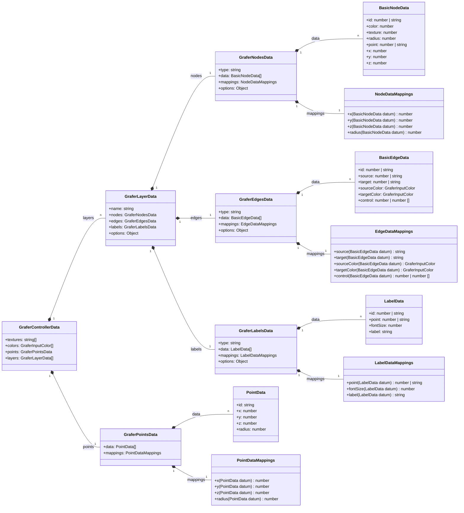

```mermaid
classDiagram

direction LR

GraferControllerData "1" *-- "n" GraferLayerData : layers
GraferControllerData "1" *-- "1" GraferPointsData: points
GraferLayerData "1" *-- "1" GraferNodesData : nodes
GraferLayerData "1" *-- "1" GraferEdgesData : edges
GraferLayerData "1" *-- "1" GraferLabelsData : labels
GraferEdgesData "1" *-- "n" BasicEdgeData : data
GraferEdgesData "1" *-- "1" EdgeDataMappings : mappings
GraferNodesData "1" *-- "n" BasicNodeData : data
GraferNodesData "1" *-- "1" NodeDataMappings : mappings
GraferPointsData "1" *-- "n" PointData : data
GraferPointsData "1" *-- "1" PointDataMappings : mappings
GraferLabelsData "1" *-- "n" LabelData : data
GraferLabelsData "1" *-- "1" LabelDataMappings : mappings

class GraferControllerData {
  +textures: string[]
  +colors: GraferInputColor[]
  +points: GraferPointsData
  +layers: GraferLayerData[]
}

class GraferLayerData {
  +name: string
  +nodes: GraferNodesData
  +edges: GraferEdgesData
  +labels: GraferLabelsData
  +options: Object 
}

class GraferPointsData {
   +data: PointData[]
   +mappings: PointDataMappings
}

class GraferNodesData {
  +type: string
  +data: BasicNodeData[]
  +mappings: NodeDataMappings
  +options: Object
}

class BasicNodeData {
  +id: number | string
  +color: number  
  +texture: number
  +radius: number
  +point: number | string
  +x: number
  +y: number
  +z: number
}

class NodeDataMappings {
  +x(BasicNodeData datum) number
  +y(BasicNodeData datum) number
  +z(BasicNodeData datum) number
  +radius(BasicNodeData datum) number
}

class GraferEdgesData{
  +type: string
  +data: BasicEdgeData[]
  +mappings: EdgeDataMappings
  +options: Object
}

class BasicEdgeData {
  +id: number | string
  +source: number | string
  +target: number | string
  +sourceColor: GraferInputColor
  +targetColor: GraferInputColor
  +control: number | number []
}

class EdgeDataMappings {
  +source(BasicEdgeData datum) string
  +target(BasicEdgeData datum) string
  +sourceColor(BasicEdgeData datum) GraferInputColor
  +targetColor(BasicEdgeData datum) GraferInputColor
  +control(BasicEdgeData datum) number | number []
}

class PointData {
  +id: string
  +x: number
  +y: number
  +z: number
  +radius: number
}

class PointDataMappings {
  +x(PointData datum) number
  +y(PointData datum) number
  +z(PointData datum) number
  +radius(PointData datum) number
}

class GraferLabelsData {
  +type: string
  +data: LabelData[]
  +mappings: LabelDataMappings
  +options: Object
}

class LabelData {
  +id: number | string
  +point: number | string
  +fontSize: number
  +label: string
}

class LabelDataMappings {
  +point(LabelData datum) number | string
  +fontSize(LabelData datum) number
  +label(LabelData datum) string
}
```